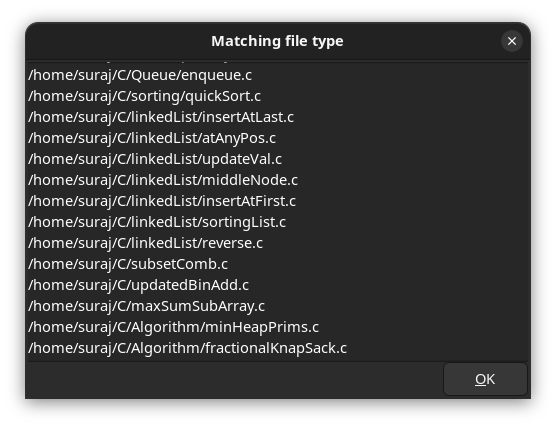

### Name - Suraj Paswan
### Roll no - 23111064
### Subject - SPC
### Task - Adding Custom feature to exsiting GTK Source Code.

# Adding a Custom Feature - To list similar File type in Find & Replace Dialog of Gedit version 3.30.0
The objective of this is to extend the functionality of the "Find and Replace" dialog in Gedit (GNOME Text Editor) by introducing a "List similar file types" feature. This feature allows users to list all files within a specified directory that match the current file’s extension, making it easier to work with multiple related files.

## File Worked on - gedit-replace-dialog.c
This file is part of the Gedit source code and handles the logic and UI for the "Replace" dialog used in text search and replacement operations. 
### Key Modification made in this file. 
1) Added new member variable to Structure.  
    A GtkCheckButton named list_similar_files_checkbutton is added to the GeditReplaceDialog structure to manage the new checkbox widget.  

2) Added a new Function called - on_list_similar_files_toggled()  
A function named on_list_similar_files_toggled() is implemented to define the behavior when the checkbox is toggled.  

i)Prompts the user to enter a directory path and file extension.  
ii)Uses the find shell command to search for matching files.  
iii)Collects and displays those filenames along with paths.  

3) Created and Attached the New Checkbox in the Dialog UI 
i)Initializes the checkbox with the label "List similar file types" 
ii) Attached the checkbox to the dialog's GtkGrid layout at a specific position (column 1, row 6). 
iii)At Binded the "toggled" event of the checkbox to the on_list_similar_files_toggled callback function, enabling dynamic behavior when the user interacts with the checkbox. 

## How to run & test the implemented functionality. 
1) Download the gedit source file with version gedit-3.30.0
2) Configure the source file using command 
    ``` ./configure  --disable-spell```
3) Compile the source code  
    ``` sudo make  ```  
4) Install the compile binaries file to standard system path to execute the gedit globally.  
    ``` sudo make install ```  
5) Test the gedit from its build directory  
   ``` ./gedit ```


## Output 
1) CheckBox with List similar file type inside Find & Replace dialog


2) On click of that checkbox , a dialog box appear asking to enter File path & File type to be searched for.


3) The result dialog box with all same file types.


     

